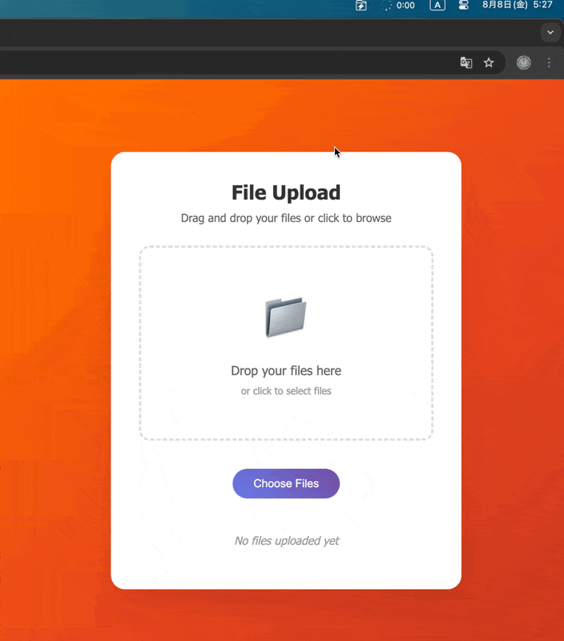

 
 <h1 align="center">QuickShelf</h1>

> A lightning-fast macOS menu-bar “shelf” that shows any folder’s contents for instant drag & drop access.

## Features

- 📁 Instant access to any folder's contents
- 📦 Drag & drop support
- ⚡ Lightweight and fast

## License

MIT License